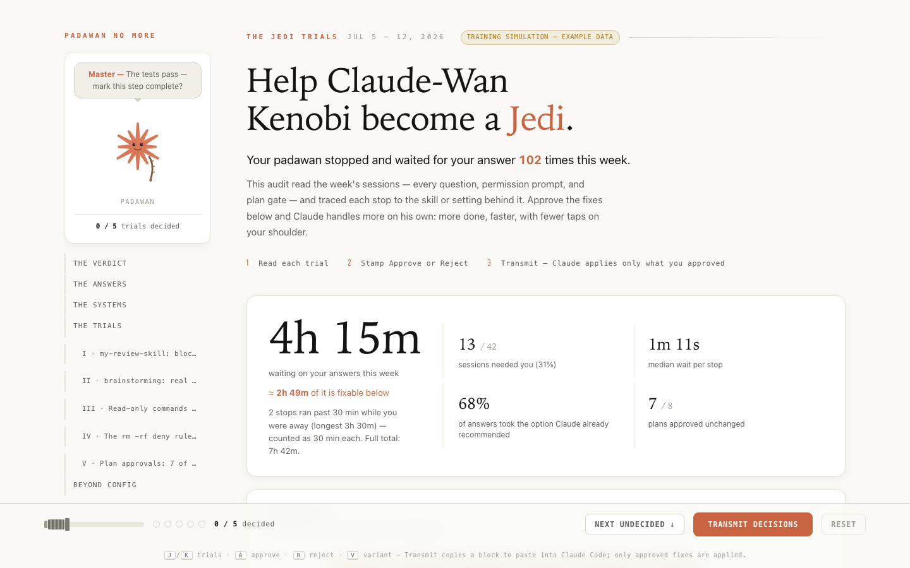
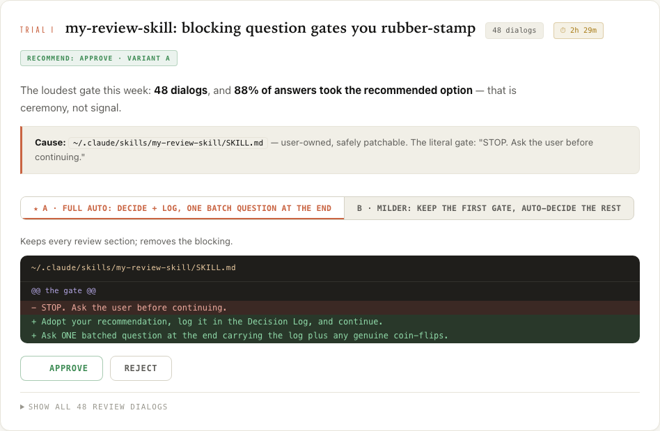
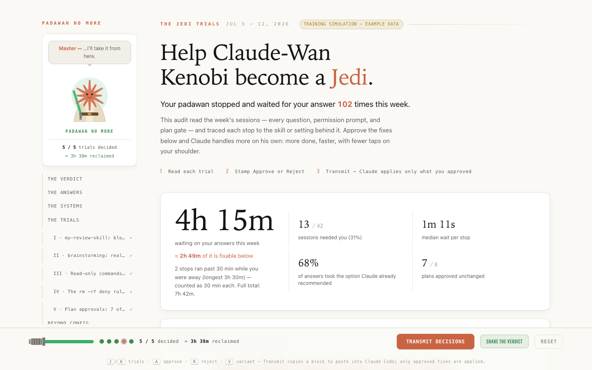
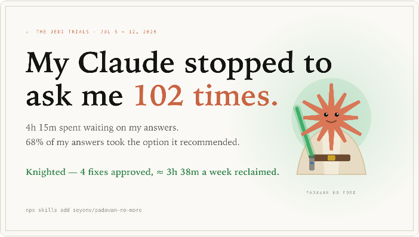

<div align="center">


# Padawan No More

**Your Claude has been a padawan long enough. Run the Jedi Trials. Knight it.**

```bash
npx skills add seyonv/padawan-no-more
```

</div>

---

Last week, Claude-Wan Kenobi stopped mid-mission to ask for guidance **129 times** —
about 9 hours of a very capable Jedi standing in your doorway, waiting.
And 80% of the time, your answer was… the option he had already recommended.

> _"Master, shall I proceed?"_ — Yes.
> _"Master, the recommended option?"_ — Yes.
> _"Master—"_ — **YES.**

Those stops aren't fate. Every one is caused by a specific line in a specific
file — a skill that mandates "STOP and ask", a missing permission rule, a
CLAUDE.md habit. `padawan-no-more` finds those lines and hands you the diffs.

## What it does, exactly

A Claude Code skill. You say _"how often did you need me this week?"_ and it:

1. **Scans your transcripts locally** (`~/.claude/projects/*.jsonl`) — every
   question dialog and which option you picked, every plan-mode approval,
   every permission denial, every Escape press, the permission prompts you
   **approved** (inferred — the transcript logs denials, not approvals), and how
   long Claude sat blocked waiting for each answer.
2. **Traces every stop to its cause** — the literal line in a SKILL.md,
   settings.json, or CLAUDE.md that forced it.
3. **Builds the Trials map** — an interactive local page, one trial card per
   root cause, costliest first, that assembles itself in your browser while
   the audit runs.
4. **You stamp each fix Approve or Reject** — every card carries a ready
   unified diff. `J`/`K` to move, `A`/`R` to stamp, `V` to switch variants.
5. **Transmit** — one copied block carries the approved diffs back into any
   Claude Code session; exactly those are applied, nothing else.

Everything runs on your machine. Nothing is uploaded, ever.



## The trials

One card per root cause, with receipts: how often it stopped you, what the
waiting cost, the exact file responsible, and 1–2 fix variants as real diffs.
Nothing changes until you transmit.



The judgment rule at the heart of it: a gate whose answers are ≥80%
"first option" is **ceremony** — automate it. A gate with real free-text
answers is **signal** — keep it, batch it. And some stops should never be
fixed: the audit recommends _keeping_ destructive-command guardrails.
A Jedi craves not `rm -rf`.

### The prompts you keep saying "yes" to

There's a quieter drain than the ones you deny: the permission prompts you
**approve**, over and over — "run `npm test`?" _yes_, "edit this file?" _yes_ —
each one a small pause while a capable Jedi waits in your doorway. Claude Code's
logs record the prompts you _denied_, but not the ones you approved, so padawan
**infers** them: a command that ran, in a project where a prompt was possible,
that none of your allow-rules covered. For each one it hands you a **narrow**
allow rule — `Bash(git commit *)`, the exact command family, never a blanket
`Bash(*)` that would trade the prompt for the keys to your machine. Because it's
inferred, the count is a floor, not gospel — and if you've already allowed
everything, it honestly tells you there's nothing to fix here.

| Signal                   | What you learn                                                                                                                                                                              |
| ------------------------ | ------------------------------------------------------------------------------------------------------------------------------------------------------------------------------------------- |
| **Skill question gates** | Which skills mandate `AskUserQuestion` stops — with the % of answers that just took the recommended option (ceremony → automate) vs. free-text (real signal → batch, don't silence)         |
| **Plan-mode approvals**  | How often plan gates actually changed anything                                                                                                                                              |
| **Permission denials**   | Deny-list hits and missing allowlist rules                                                                                                                                                  |
| **Approved prompts**     | The mutating commands you keep approving that no allow-rule covers (inferred, deduped per session) — each becomes a **narrowly-scoped** `permissions.allow` diff, never a blanket `Bash(*)` |
| **Time cost**            | Waiting time per stop, skill, project, and day — plus the five single costliest stops, with exact durations                                                                                 |
| **What NOT to fix**      | Destructive-command guardrails get the diff shown and a **reject** recommendation                                                                                                           |

## The knighting

As you decide, Claude the padawan — the starburst in robes with a braid —
levels up in the sidebar: robe, belt, saber hilt… and when the last trial is
decided, the blade ignites and the braid is cut.



Then **Share the verdict** appears: your week's numbers as a PNG card,
rendered entirely on your machine. Save it, post it, flex it.



## Install

One command, pick your flavor:

```bash
npx skills add seyonv/padawan-no-more
```

or as a Claude Code plugin:

```
/plugin marketplace add seyonv/padawan-no-more
/plugin install padawan-no-more@padawan-no-more
```

or the classic way:

```bash
git clone https://github.com/seyonv/padawan-no-more ~/.claude/skills/padawan-no-more
```

Pick **one** — each method installs a full copy, and two copies means Claude
sees the skill twice.

## Run it

> Run /padawan-no-more on my last week of conversations.

Or in your own words — the skill triggers on things like:

> How often did you need me this week? You're not a padawan anymore — audit it
> and show me what to change.

Claude scans your transcripts, investigates the causes, builds the Trials map,
and hands you a link. Stamp, transmit, paste — done.

**Light week?** If the scan finds too few stops to be interesting, ask for the
**training simulation** — a full map built from bundled example data, clearly
stamped as such — or widen the window ("audit the last 30 days").

## Configuration

Say it in the prompt — the skill passes it through:

| What          | How                                                                                                                                                                           | Default |
| ------------- | ----------------------------------------------------------------------------------------------------------------------------------------------------------------------------- | ------- |
| Audit window  | "audit the last **30 days**" → `scan.py --days 30`                                                                                                                            | 7 days  |
| Walk-away cap | "cap waits at **10 minutes**" → `build_page.py --cap 600` — waits longer than this count as you-were-away and are capped in the totals (exact durations still shown per stop) | 30 min  |

## Recording a demo? Retaking decisions?

Decisions are saved in localStorage, scoped to each audit's date range, so they
survive reloads without bleeding between weeks. For a clean slate:

- **Reset** in the bottom bar — clears all stamps instantly
- **`?fresh=1`** on the page URL — stateless mode: starts empty every load and
  never saves. Perfect for multiple recording takes.

## Under the hood

```
scan.py ──▶ interventions.json ──▶ Claude reads causes ──▶ cards.json ──▶ build_page.py ──▶ map.html
 (parses ~/.claude/projects/*.jsonl:      (reads settings.json,   (fix diffs +
  every AskUserQuestion + which option     SKILL.md gates,         recommendations)
  you picked, plan approvals, denials,     CLAUDE.md rules)
  interruptions, wait times, and the
  prompts you likely approved — inferred
  from settings.json allow-rules)
```

Everything runs locally. Nothing leaves your machine except the map page you
choose to publish.

Deterministic parts (`scan.py`, `build_page.py`) are covered by a stdlib test
suite — run `python3 -m unittest discover tests` (no dependencies).

## Safety defaults

- Never recommends removing destructive-command deny rules (shows the diff,
  recommends **reject**)
- Never allowlists mutating MCP tools or arbitrary-code-execution commands
- Fixes for approved prompts are **narrow** allow rules (the exact command
  family), never a blanket `Bash(*)`; a broad option, if shown, is reject-flagged
- Flags plugin-cache patches as ephemeral (overwritten on plugin update) and
  offers a durable CLAUDE.md override instead

> _"Approve, or approve not. There is no 'ask again later.'"_ — the Council

## License

MIT. Not affiliated with, endorsed by, or associated with Lucasfilm or Disney —
this is a fan-flavored developer tool that uses "padawan" the way your team lead
does.
